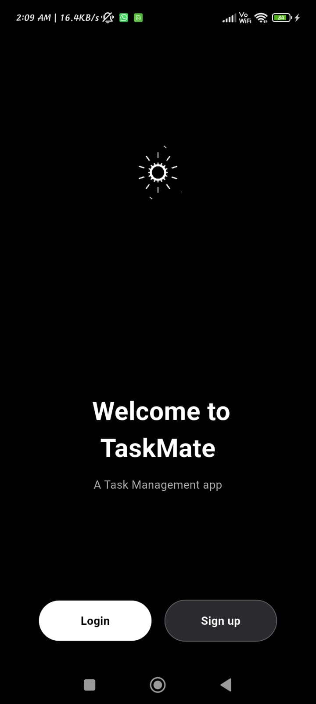
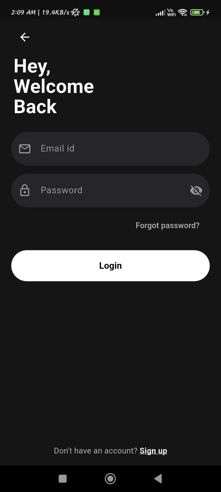
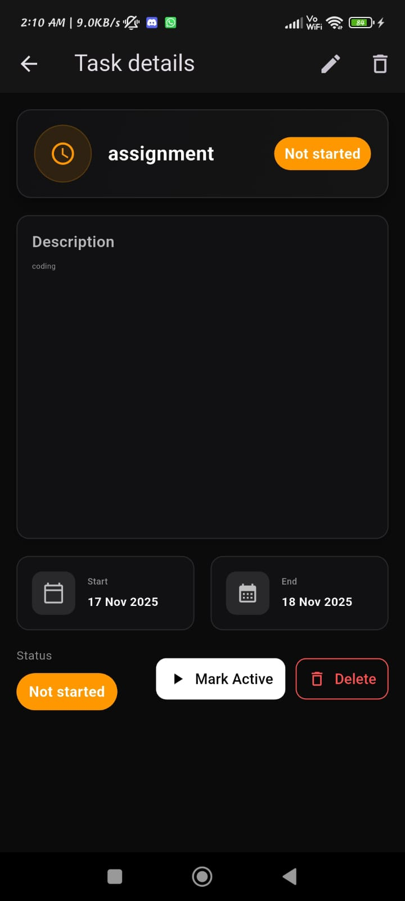
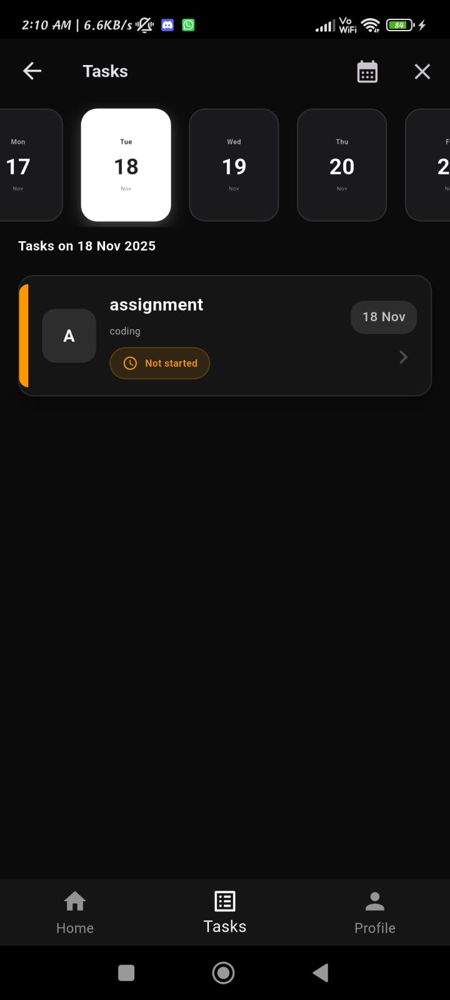
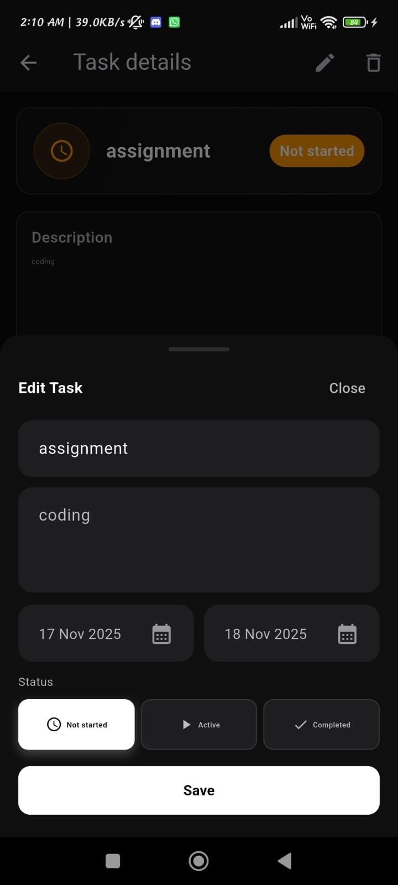

# TaskMate


[](https://flutter.dev)
[](./LICENSE)
[](https://github.com/YOUR_USER/YOUR_REPO/issues)
[](https://github.com/YOUR_USER/YOUR_REPO/releases)

---

## 🚀 Overview
TaskMate is a **modern Flutter-based task management app** featuring:
- 🔐 JWT Authentication (Login & Register)
- 🟢 Task State Management (Not Started → Active → Completed)
- 📅 Smart Date Management
- 🖥️ Elegant UI + Animations
- 📦 Provider for State Management
- 🔒 Secure Storage for tokens
- 🏗️ Backend-ready (Node.js / MongoDB)

---

## 📸 Screenshots
   <br/>    <br/> </div>

---

## 🛠️ Features
- 🧩 Clean UI with smooth transitions
- 🔄 Auto-refreshing tasks after update
- ✏️ Bottom-sheet task editor
- 🗑️ Delete with confirmation
- 📱 Works on Android, iOS, and Web
- 🔐 Auto-login with stored tokens
- 🧵 Optimized network handling
- ⚡ Release-ready performance tuning

---

## 📂 Project Structure

```
.

├── android/
├── ios/
├── assets/
│   └── readme-banner.svg
├── lib/
│   ├── main.dart
│   ├── config.dart
│   ├── services/
│   │   ├── auth_service.dart
│   │   ├── task_service.dart
│   ├── screens/
│   │   ├── WelcomeScreen.dart
│   │   ├── login_screen.dart
│   │   ├── register_screen.dart
│   │   ├── home_screen.dart
│   │   ├── task_list_screen.dart
│   │   ├── task_detail_screen.dart
│   ├── widgets/
│   │   ├── task_card.dart
│   │   ├── task_list_item.dart
│   └── utils/
│       └── date_utils.dart
├── pubspec.yaml
├── README.md
└── LICENSE
```

---

## 🧪 Running the App

### Install dependencies
```sh
flutter pub get
```

### Run on device
```sh
flutter run
```

### Build release APK
```sh
flutter build apk --release
```

---

## 💡 Environment Setup
Create `config.dart`:
```dart
class AppConfig {
  static const baseUrl = "https://your-backend-url.com";
}
```

---

## 🤝 Contributing
PRs are welcome! Please follow standard Flutter formatting before submitting.

---
## ✍️Author

- **Asim Siddiqui**
- **Contact Information**
    - Email: asimsiddiqui8181@gmail.com
    - LinkedIn: [Asim Siddiqui](https://www.linkedin.com/in/asim-siddiqui-a71731229/)
    - Portfolio: [Asim Sidd](https://asimsidd.vercel.app/)

## 📄 License
This project is licensed under the **MIT License**.

---

## ⭐ Support
If you like TaskMate, give the repo a star ⭐ — it motivates development!
